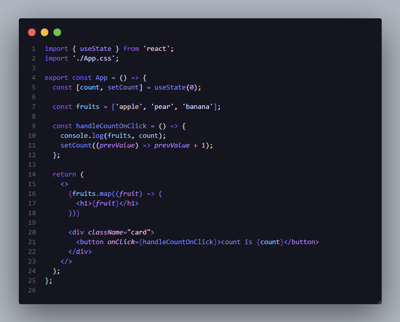

    
    <h2 align="center">Violet Dream for VSCode</h2>

Soothing and serene color extension design to create a peaceful coding environment 💜

 

## Installation

1. Open [VSCode](https://code.visualstudio.com)

2. Open the **Extensions** sidebar panel in VS Code. `View → Extensions`

3. Search for `Violet Dream`

4. Click `Install`

5. When prompted, select `Violet Dream` as the color theme

> In case of not being prompted to select a Color Theme upon installing, go to the menu bar and select: `Code (File, on Windows) > Preferences > Color Theme > Violet Dream`.

 

## Gallery

**Violet Dream - VSCode**

**Violet Dream - CodeSnap**

 

## Issues

If you found an issue, you can report it in the [github issues](https://github.com/AlexandreFPGoncalves/violet-dream/issues).
